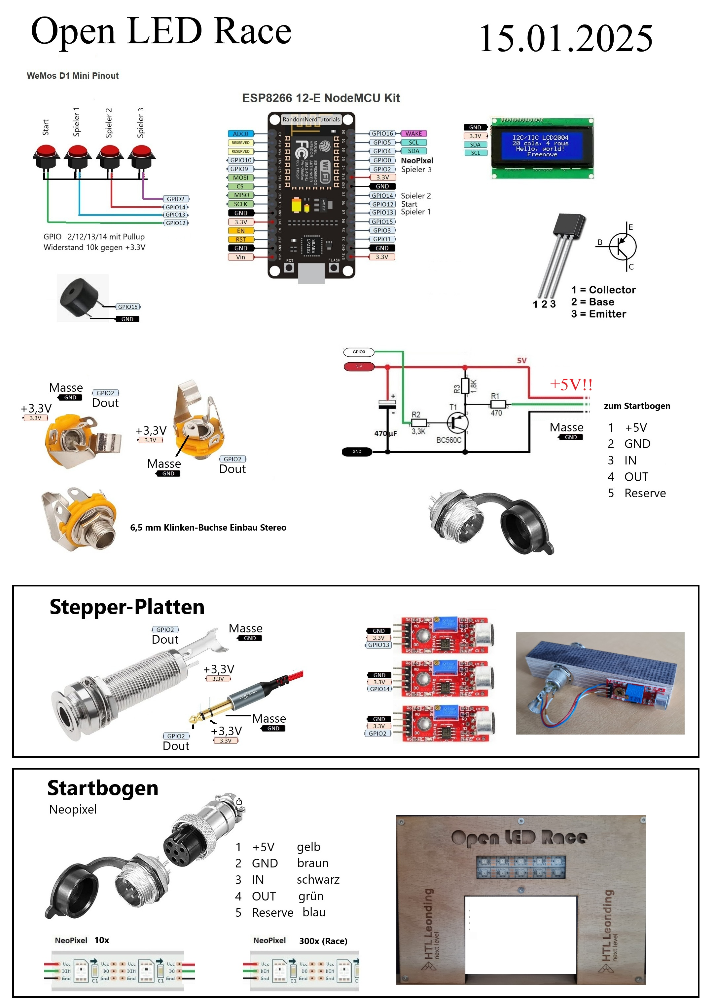
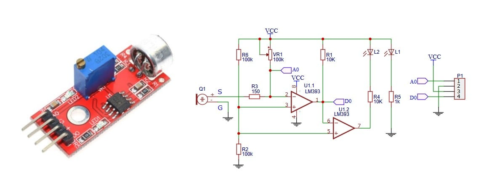

# Open LED Race



## TODO

* htl logo
* seitentitel
* hintergrundd

## ESP8266 Pinout

<https://randomnerdtutorials.com/esp8266-pinout-reference-gpios/>

## KY-038 Schematic

Screwing IN the potentiometer increases the microphone sensitivity.
Screwing OUT the potentiometer decreases the microphone sensitivity.



## Secrets

You'll need to create a `MqttCredentials.h` and `WiFiCredentials.h` file in the `include` folder with the following content:

```cpp
// MqttCredentials.h
#define MY_MQTT_BROKER "test.mosquitto.org"
#define MY_MQTT_PORT 1883
#define MY_MQTT_USERNAME "username"
#define MY_MQTT_PASSWORD "password"

// WiFiCredentials.h
#define MY_SSID "ssid"
#define MY_PASSWORD "password"
```
